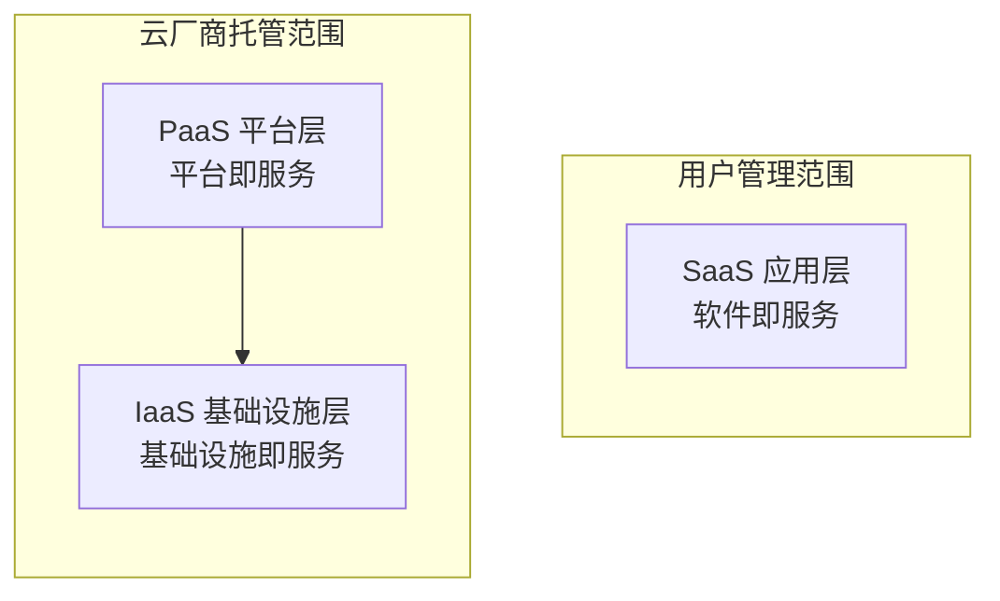

# 1.1 云架构设计概论

## 课程简介

云架构是构建和运行云服务的基础蓝图，它定义了云环境中的组件、组件间的关系以及它们与用户、外部系统的交互方式。一个优秀的云架构设计能够显著提升业务的性能、可靠性、安全性，同时最大化成本效益。

本课程将系统讲解云架构设计的核心概念、设计原则和最佳实践，帮助您从传统 IT 思维转型为云原生思维，构建高效、稳定、安全的云上业务系统。

### 学习目标

通过本课程的学习，您将能够：

- ✓ **理解云计算本质**：深入掌握云计算的定义、八大特征及分层架构（IaaS/PaaS/SaaS）。
- ✓ **掌握部署模式**：区分公有云、私有云、专有云及混合云的特点与适用场景。
- ✓ **洞察信创趋势**：了解信息技术应用创新（信创）的背景、架构及国产化替代战略。
- ✓ **运用设计方法**：掌握云架构设计的五步流程与核心方法论。
- ✓ **实践六大原则**：熟练运用高可用、弹性扩展、安全合规等六大设计原则。

---

# 第一部分：云计算基础

> **本部分导读**  
> 在深入架构设计之前，必须夯实理论基础。本部分将从标准定义、服务分层、核心特征及部署模式四个维度，全方位解析云计算。

## 一、云计算的定义与核心价值

### 1.1 权威定义（NIST）

美国国家标准与技术研究所（NIST）对云计算的定义如下：

> 云计算是一种模型，它可以实现随时随地、便捷地、随需应变地从可配置计算资源共享池中获取资源（例如网络、服务器、存储、应用和服务），资源能够快速供应并释放，使管理资源的工作量和与服务提供商的交互减小到最低限度。

**关键词解析：**
- **便捷访问**：通过互联网随时随地接入。
- **资源池化**：多租户共享底层物理资源。
- **按需自助**：用户无需人工干预即可获取资源。
- **快速弹性**：资源规模可随业务需求动态调整。

### 1.2 通俗类比：计算资源的水电化

云计算将计算能力转化为像水、电一样的公共服务：

| 维度 | 传统 IT 模式 (自建井/发电机) | 云计算模式 (自来水/电网) |
| :--- | :--- | :--- |
| **获取方式** | 自建机房、采购服务器、部署网络 | 联网即用，按需申请 |
| **投资模式** | CAPEX（资本性支出），前期投入大 | OPEX（运营性支出），按量付费 |
| **扩展能力** | 扩容周期长（周/月），容量固定 | 弹性伸缩（分钟级），无限容量 |
| **运维责任** | 用户负责全栈硬件及软件维护 | 云厂商负责基础设施，用户专注业务 |

### 1.3 云计算的核心优势

1.  **灵活扩展（Elasticity）**：从容应对业务波峰波谷，如电商大促期间自动扩容，活动结束后自动缩容。
2.  **高可用性（Availability）**：基于多副本、多可用区（AZ）架构，提供远高于传统 IDC 的服务可用性承诺（SLA）。
3.  **成本优化（Cost）**：消除闲置资源浪费，通过按量计费和竞价实例降低 TCO（总体拥有成本）。
4.  **快速部署（Agility）**：基础设施即代码（IaC），将环境搭建时间从数周缩短至数分钟。

## 二、云计算分层架构

云计算主要包含三种服务模式，自下而上分别为 IaaS、PaaS 和 SaaS。



### 2.1 基础设施即服务（IaaS）
**定义**：提供虚拟化的计算、存储、网络等基础资源。用户拥有最高自由度，类似于租用“裸机”。
- **核心产品**：云服务器（CVM）、云硬盘（CBS）、私有网络（VPC）。
- **适用对象**：系统管理员、IT 架构师。
- **典型场景**：企业原有应用的“搬迁上云”（Rehost），搭建自定义环境。

### 2.2 平台即服务（PaaS）
**定义**：提供应用开发、运行、管理所需的平台环境，用户无需管理底层操作系统和硬件。
- **核心产品**：云数据库（TDSQL/MySQL）、容器服务（TKE）、云函数（SCF）、人工智能服务。
- **适用对象**：应用开发人员。
- **典型场景**：敏捷开发、微服务架构、大数据分析、AI 模型训练。

### 2.3 软件即服务（SaaS）
**定义**：通过互联网直接提供完整的软件应用，用户开箱即用，无需关心任何技术细节。
- **核心产品**：腾讯会议、企业微信、腾讯文档、千帆平台应用。
- **适用对象**：普通终端用户。
- **典型场景**：协同办公、CRM、ERP、在线视频会议。

## 三、云计算的八大核心特征

| 特征 | 详细说明 | 腾讯云体现 |
| :--- | :--- | :--- |
| **1. 超大规模** | 拥有百万级服务器规模，提供海量算力支持。 | 腾讯云全网服务器数量超百万台，数据存储规模达 EB 级。 |
| **2. 高可靠性** | 通过多副本、纠删码等技术保障数据不丢失。 | 云硬盘提供 99.9999999% 的数据可靠性。 |
| **3. 虚拟化** | 资源逻辑抽象，实现物理硬件与操作系统解耦。 | 采用自研 KVM 虚拟化及星星海服务器技术。 |
| **4. 高可用性** | 服务中断自动恢复，故障自动迁移。 | CVM 宕机自动热迁移，数据库主备秒级切换。 |
| **5. 通用性** | 同一云平台支撑不同行业、不同类型的应用。 | 支撑游戏、金融、政务、电商等全行业场景。 |
| **6. 弹性扩展** | 资源随业务负载动态调整，无缝伸缩。 | 弹性伸缩（AS）服务，支持定时、监控指标触发扩缩容。 |
| **7. 按需服务** | 像自助餐一样，按需取用，用完即走。 | 支持按秒计费、按小时计费、包年包月等多种模式。 |
| **8. 极其廉价** | 规模效应带来边际成本降低，让利于用户。 | 持续降低算力成本，提供高性价比的实例类型。 |

## 四、云计算的部署类型

### 4.1 四种模式对比

| 类型 | 定义 | 优势 | 劣势 | 适用场景 |
| :--- | :--- | :--- | :--- | :--- |
| **公有云** | 第三方提供，资源向公众开放 | 成本低、弹性极强、免运维 | 数据控制权相对较弱 | 互联网应用、中小企业、弹性业务 |
| **私有云** | 企业自建自用，资源独享 | 数据完全自主可控、安全性高 | 建设成本高、维护复杂、弹性差 | 金融核心系统、政府涉密业务 |
| **专有云** | 公有云厂商为特定客户定制的隔离环境 | 兼具公有云技术与私有云合规 | 成本较高 | 大型央企、政务云 |
| **混合云** | 公有云 + 私有云/IDC | 灵活性与安全性平衡 | 架构复杂度高、网络互通难 | 银行（核心在私有，前端在公有）、跨国企业 |

### 4.2 腾讯云混合云架构示例
企业将核心敏感数据（如用户账务）部署在**本地 IDC** 或 **私有云（TStack）**，将面向互联网的前端应用（如 Web 服务）部署在**腾讯公有云**，通过**专线（Direct Connect）** 或 **VPN** 打通网络。

---

# 第二部分：信息技术应用创新（信创）

> **本部分导读**  
> 信创（信息技术应用创新）是我国实现科技自立自强的重要战略。了解信创生态是当前国内云架构师的必修课。

## 一、信创战略背景

### 1.1 核心目标
解决核心技术“卡脖子”问题，实现从硬件到软件的**全栈自主可控**，保障国家信息安全。

### 1.2 发展规划
- **2+8+N 体系**：优先在党政（2）领域突破，逐步扩展至金融、电信、电力、石油、交通、教育、医疗、航空航天（8）等关键行业，最终覆盖全行业（N）。
- **时间节点**：计划到 2027 年底，国企央企完成核心系统的信创改造。

## 二、信创生态体系（四梁八柱）

信创产业链主要分为四个层次，腾讯云在其中扮演了重要角色。

### 2.1 基础硬件（芯片与整机）
- **CPU**：华为鲲鹏（ARM）、飞腾（ARM）、海光（x86）、龙芯（LoongArch）、申威。
- **整机**：长城、浪潮、联想、曙光等国产服务器。

### 2.2 基础软件（OS与数据库）
- **操作系统**：麒麟软件（Kylin）、统信（UOS）、**腾讯云 OpenCloudOS**。
- **数据库**：达梦、人大金仓、**腾讯云 TDSQL**（分布式数据库）。
- **中间件**：东方通、宝兰德。

### 2.3 云基础设施
- **云平台**：**腾讯专有云 TCE**、TStack、华为云 Stack。
- **核心能力**：提供全面兼容国产芯片和操作系统的云底座，实现“一云多芯”。

### 2.4 应用软件
- **办公管理**：金山 WPS、**企业微信**、**腾讯会议**。
- **业务系统**：用友、金蝶、致远互联。

---

# 第三部分：云架构设计方法论

> **本部分导读**  
> 架构设计不仅仅是画图，更是一套严谨的逻辑流程。本节介绍标准的五步设计法。

## 一、架构设计的五步流程

一个完整的云架构设计周期应遵循以下五个步骤：

```
1. 需求分析 → 2. 架构设计 → 3. 评估改进 → 4. 交付实施 → 5. 持续运营
```

### 第一步：需求分析 (Requirement Analysis)
**核心任务**：明确“做什么”和“约束条件”。
- **业务需求**：用户量级、并发峰值、数据规模、业务增长率。
- **技术指标**：RTO/RPO（容灾指标）、响应时间（延迟）、吞吐量。
- **约束条件**：预算限制、合规要求（等保、GDPR）、上线时间。

### 第二步：架构设计 (Architecture Design)
**核心任务**：输出架构图和技术方案。
- **模块划分**：接入层、逻辑层、数据层分离。
- **选型决策**：选择合适的云产品（如选用 CVM 还是 Serverless）。
- **数据流设计**：规划数据的产生、处理、存储和销毁路径。

### 第三步：评估改进 (Evaluation & Refinement)
**核心任务**：验证方案可行性。
- **POC 测试**：对关键技术点进行概念验证。
- **成本估算**：使用云价格计算器预估 TCO。
- **风险评估**：识别单点故障、安全漏洞。

### 第四步：交付实施 (Implementation)
**核心任务**：资源创建与部署。
- **IaC 实践**：使用 Terraform 或 ROS 自动化部署资源。
- **环境隔离**：划分 Dev、Test、Prod 环境。
- **数据迁移**：存量数据的搬迁上云。

### 第五步：持续运营 (Continuous Operation)
**核心任务**：监控与优化。
- **可观测性**：部署监控大盘、日志分析。
- **成本优化**：定期清理僵尸资源。
- **故障演练**：定期进行红蓝对抗和混沌工程。

---

# 第四部分：云架构设计六大原则

> **本部分导读**  
> 类似于“架构师宣言”，这六大原则应贯穿于每一个设计决策中。

## 原则一：合理部署 (Deployment)
**核心思想**：避免将鸡蛋放在同一个篮子里。
- **多可用区（Multi-AZ）**：将应用部署在同地域的多个可用区，防范机房级故障（火灾、断电）。
- **就近接入**：根据用户分布选择地域，或利用 CDN 和全球应用加速（GAAP）提升访问速度。
- **资源隔离**：使用 VPC 子网划分 Web 层、App 层和 DB 层，通过 ACL 和安全组控制流量。

## 原则二：业务持续 (Business Continuity)
**核心思想**：假设故障必然发生，设计自动恢复机制。
- **消除单点**：所有组件（负载均衡、应用服务器、数据库）都必须是集群或主备模式。
- **容灾标准**：
    - **同城双活**：业务同时在两个 AZ 运行，RPO=0。
    - **两地三中心**：同城双中心 + 异地灾备中心，防范地域性灾难（地震、洪水）。
- **数据备份**：实施定期的快照策略和异地复制。

## 原则三：弹性扩展 (Elasticity)
**核心思想**：资源应随负载像呼吸一样自然伸缩。
- **横向扩展（Scale Out）**：增加机器数量（如 AS + CLB），优于纵向扩展（Scale Up，升级 CPU/内存）。
- **自动化**：基于 CPU 利用率或 QPS 阈值触发自动伸缩，无需人工介入。
- **无状态设计**：应用层不存储 Session（会话），状态下沉至 Redis 或数据库，以便随时增删节点。

## 原则四：性能效率 (Performance)
**核心思想**：用最少的资源换取最快的响应。
- **缓存优先**：在计算和存储之间增加缓存层（Redis/Memcached），在网络边缘增加 CDN。
- **读写分离**：数据库采用主从架构，主库写、从库读，提升吞吐量。
- **异步解耦**：使用消息队列（CKafka/CMQ）削峰填谷，防止后端服务被瞬时流量压垮。

## 原则五：安全合规 (Security)
**核心思想**：安全是生命线，实行“责任共担模型”。
- **纵深防御**：
    - **边缘层**：DDoS 防护、WAF（Web 应用防火墙）。
    - **网络层**：安全组、网络 ACL。
    - **主机层**：主机安全（云镜）、漏洞扫描。
    - **数据层**：加密存储（KMS）、数据脱敏。
- **最小权限**：通过 CAM（访问管理）为每个员工和云服务分配最小必要权限。

## 原则六：持续运营与成本优化 (Operations & Cost)
**核心思想**：既要跑得稳，又要跑得省。
- **全方位监控**：利用腾讯云可观测平台（TCOP）监控基础指标和业务指标。
- **成本控制**：
    - 稳定业务使用**包年包月**或**预留实例**。
    - 突发业务使用**按量计费**。
    - 无状态批处理任务使用**竞价实例**（Spot）。
- **标签管理**：为资源打标签（Tag），按项目或部门精细化分账。

---

# 课程总结与行动指南

## 知识体系回顾
本章作为全套课程的基石，构建了云架构师的思维框架：
1.  **基础**：理解 IaaS/PaaS/SaaS 及公有/私有/混合云的区别。
2.  **趋势**：拥抱信创，掌握国产化替代的架构方向。
3.  **方法**：遵循“需求-设计-实施-运营”的闭环流程。
4.  **原则**：时刻牢记“高可用、弹性、安全、成本”等六大设计原则。

## 架构师检查清单 (Checklist)
在开始下一个实际案例设计前，请自问：
- [ ] 我的设计是否存在单点故障？
- [ ] 流量突增 10 倍时，系统能否自动应对？
- [ ] 假如发生数据中心级别的灾难，数据是否安全？
- [ ] 我是否选择了性价比最高的云产品组合？
- [ ] 系统的每一个层面是否都有安全防护？

下一章，我们将深入**2.1 云服务器 CVM 及最佳实践**，开始构建云上计算基础。