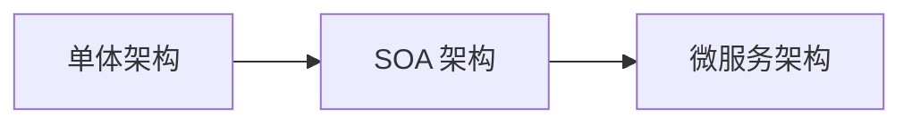
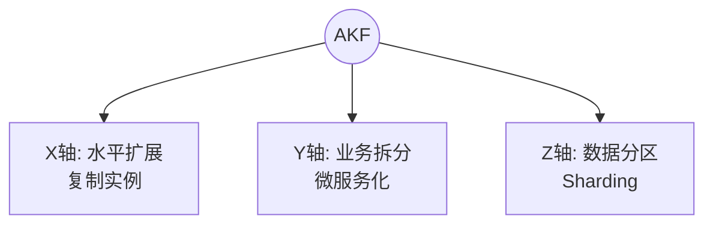
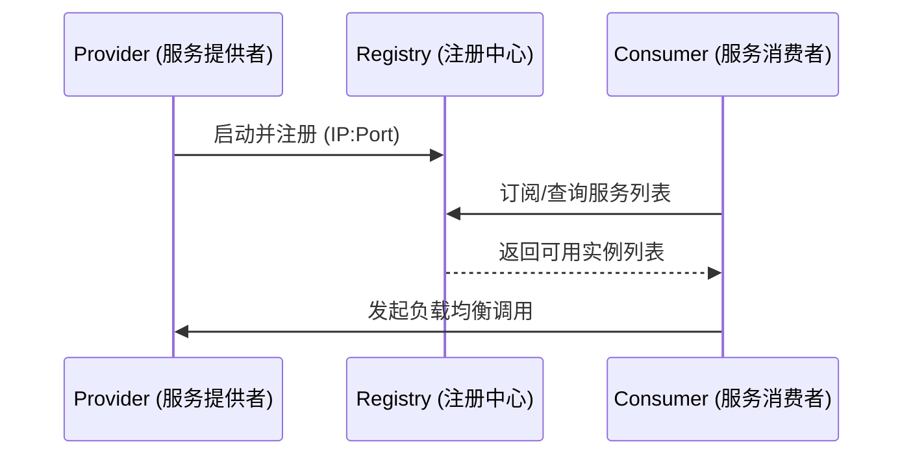

# 2.14 微服务概述及最佳实践

## 课程简介

微服务架构是现代云原生应用的核心架构模式，它将复杂的单体应用拆分为多个独立的、可独立部署的服务单元。本课程将系统讲解微服务的演进历程、核心概念、设计原则和最佳实践，并深入剖析腾讯云微服务产品矩阵（TSE、TEM、TSF）的区别与选型，帮助您构建企业级微服务架构。

### 学习目标

通过本课程的学习，您将能够：

- ✓ **理解架构演进**：清晰描述从单体到 SOA 再到微服务的演变逻辑及优缺点。
- ✓ **掌握设计原则**：熟练运用 AKF 扩展立方、无状态设计、前后端分离等核心原则。
- ✓ **熟悉腾讯云产品**：准确区分 TSE（引擎）、TEM（弹性）、TSF（平台）的适用场景。
- ✓ **实施最佳实践**：掌握灰度发布、弹性伸缩、跨可用区容灾及就近路由的配置与落地。

---

# 第一部分：应用架构演进

> **本部分导读**  
> 架构不是一蹴而就的。了解从单体到微服务的演进，有助于我们在不同业务阶段做出正确的架构决策。

## 一、架构演进三阶段

### 1.1 阶段对比



| 维度 | **单体架构 (Monolith)** | **SOA 架构** | **微服务架构 (Microservices)** |
| :--- | :--- | :--- | :--- |
| **部署单元** | 一个大包 (WAR/JAR) | 多个服务子系统 | 细粒度的独立服务 |
| **通信方式** | 进程内调用 (方法调用) | ESB (企业服务总线) | 轻量级协议 (REST/RPC) |
| **数据治理** | 共享数据库 | 共享或独立数据库 | **Database per Service** (独享库) |
| **运维难度** | 简单 | 中等 | 高 (需引入 DevOps) |
| **适用场景** | 初创期、业务简单 | 集团内部系统集成 | 互联网高并发、快速迭代 |

### 1.2 微服务架构的核心特征
1.  **小而自治**：每个服务专注于单一职责（Single Responsibility），由小团队（Two-pizza team）负责。
2.  **独立部署**：服务可独立更新、回滚，不影响其他服务。
3.  **技术异构**：不同服务可以根据业务需求选择最适合的语言（Java, Go, Python）和数据库。
4.  **去中心化**：治理、数据、技术栈的去中心化管理。

---

# 第二部分：微服务设计原则

> **本部分导读**  
> 为了避免将微服务建成“分布式单体”，必须遵循正确的设计原则。

## 一、AKF 扩展立方 (Scale Cube)

AKF 原则是微服务拆分和扩展的理论基石。



| 轴线 | 含义 | 实施方式 | 解决问题 |
| :--- | :--- | :--- | :--- |
| **X 轴** | **水平扩展** | 运行多个完全相同的副本，通过负载均衡分发流量。 | 单点故障、吞吐量瓶颈。 |
| **Y 轴** | **功能拆分** | 将系统按业务功能拆分为独立服务（如订单、用户）。 | 代码复杂度高、开发维护困难。 |
| **Z 轴** | **数据分区** | 按用户 ID、地域等维度对数据进行切片（Sharding）。 | 数据库容量瓶颈、数据访问延迟。 |

## 二、无状态服务设计 (Stateless)

### 2.1 核心理念
服务实例不保存客户端的上下文信息（Session）。任何一个请求都可以被任意一个实例处理。

### 2.2 实现方案
1.  **Session 外部化**：将用户会话数据存储在 **Redis** 或 **Memcached** 中，而非本地内存。
2.  **Token 机制**：使用 JWT (Json Web Token) 将状态加密保存在客户端，服务端仅负责验签。

**价值**：
- **弹性伸缩**：新扩容的节点可以立即承接流量，无需同步 Session。
- **高可用**：任意节点宕机，用户会话不丢失。

## 三、前后端分离

- **解耦**：前端（Vue/React）与后端（Spring Boot）通过 **RESTful API** 交互。
- **并行开发**：明确接口文档（Swagger/OpenAPI）后，前后端团队可同时开工。
- **多端适配**：一套后端接口同时支持 Web、App、小程序。

---

# 第三部分：微服务管控组件

> **本部分导读**  
> 微服务数量增多后，必须要有一套基础设施来治理它们，这就是“微服务治理”。

## 一、服务注册与发现

### 1.1 核心流程


### 1.2 常见工具
- **Nacos**：阿里开源，集成了注册中心与配置中心（CP/AP 可切换）。
- **Consul**：HashiCorp 出品，支持多数据中心，基于 Go 语言。
- **Eureka**：Netflix 出品，AP 模型，Spring Cloud 早期标配。
- **Polaris (北极星)**：腾讯开源，支持多语言、虚拟机与容器混部。

## 二、微服务网关 (API Gateway)

网关是微服务集群的“大门”，所有外部请求必须经过网关。

**核心功能**：
1.  **统一接入**：路由转发、协议转换。
2.  **安全防护**：身份认证（Auth）、IP 黑白名单、防攻击。
3.  **流量控制**：限流（Rate Limiting）、熔断（Circuit Breaking）。

## 三、分布式配置管理

**痛点**：几十个微服务，每个服务有开发、测试、生产三套环境，修改配置需要重启服务。

**解决方案**：使用配置中心（如 Nacos, Apollo）。
- **集中管理**：在控制台统一修改配置。
- **动态刷新**：配置变更推送到服务，服务**热加载**，无需重启。
- **版本回滚**：支持配置的历史版本记录与回滚。

---

# 第四部分：腾讯云微服务产品矩阵

> **本部分导读**  
> 腾讯云提供了 TSE、TEM、TSF 三款微服务产品，很多用户容易混淆。本节将重点进行对比解析。

## 一、产品矩阵横向对比

| 特性 | **TSE (微服务引擎)** | **TEM (弹性微服务)** | **TSF (微服务平台)** |
| :--- | :--- | :--- | :--- |
| **定位** | **中间件托管** (PaaS) | **Serverless 应用托管** | **全生命周期管理平台** |
| **核心组件** | 云原生网关、注册配置中心、北极星治理中心 | 应用运行环境、自动伸缩控制器 | 分布式事务、链路追踪、部署组管理 |
| **管控对象** | 主要是**基础设施**（网关、Nacos、Zookeeper） | 主要是**应用**（JAR/WAR 包、镜像） | **应用 + 基础设施** |
| **适用人群** | 架构师、运维（需要托管开源组件） | 开发者（只想跑代码，不想管服务器） | 企业级客户（需要完整的微服务治理体系） |
| **底层资源** | 需购买节点 | Serverless（按量/按规格） | 虚拟机 CVM 或 容器 TKE |
| **技术栈** | 兼容所有开源生态 | Java, PHP, Go, Python, Node.js | Spring Cloud, Dubbo, Service Mesh |

## 二、TSE (Tencent Service Engine)
**核心价值**：托管开源组件，免去自建的高可用维护成本。
- **云原生网关**：基于开源 Higress/Kong 增强，性能强劲。
- **注册配置中心**：全托管的 Nacos、Zookeeper、Apollo、Consul。
- **服务治理中心**：集成北极星（PolarisMesh），提供无侵入的熔断、限流能力。

## 三、TEM (Tencent Elastic Microservice)
**核心价值**：**“不像 PaaS 的 PaaS”**，极简上云。
- **极致弹性**：根据 QPS 或 CPU 自动扩缩容，秒级响应。
- **免运维**：无需编写 Dockerfile，无需懂 K8s，直接上传 JAR 包即可运行。

## 四、TSF (Tencent Service Framework)
**核心价值**：**企业级微服务大管家**。
- **全链路治理**：从代码上传、部署、扩容、监控到下线全流程管理。
- **多技术栈兼容**：支持 Spring Cloud 应用与 Service Mesh（Sidecar 模式）应用互通。
- **数据化运营**：提供极其详尽的调用链拓扑图和性能报表。

---

# 第五部分：微服务最佳实践

## 一、灰度发布 (Canary Release)

**场景**：新版本 V2 上线，不敢全量发布，希望先让 10% 的用户试用。

**TSF/TSE 实施步骤**：
1.  **部署**：创建两个部署组，Group_V1 (90%实例) 和 Group_V2 (10%实例)。
2.  **标签**：给 Group_V2 打上标签 `version=v2`。
3.  **路由规则**：
    - 规则 A：Header 中包含 `user_type=vip` 的请求 -> 转发到 `version=v2`。
    - 规则 B：其余请求 -> 转发到 `version=v1`。
4.  **观察**：监控 V2 版本的错误率和延迟。
5.  **全量**：逐步扩大规则 A 的覆盖范围，直至 100%。

## 二、弹性伸缩 (Auto Scaling)

**场景**：大促活动，流量突增。

**策略配置**：
- **指标**：CPU 利用率 > 60% 或 QPS > 1000。
- **动作**：每次扩容 2 台，冷却时间 3 分钟（防止抖动）。
- **范围**：最小 2 台（保底），最大 50 台（防成本失控）。

## 三、就近路由与跨可用区容灾

**背景**：
同城双活部署（广州三区 + 广州四区）。跨可用区调用会有 1-2ms 的网络延迟，且产生跨区流量费。

**最佳实践**：
1.  **就近路由 (开启)**：
    - 广州三区的 Consumer **优先** 调用 广州三区的 Provider。
    - 只有当广州三区的 Provider 全部不可用时，才跨区调用广州四区。
    - **价值**：降低延迟，节省成本。
2.  **跨区容灾 (自动)**：
    - 注册中心实时检测实例健康状态。
    - 一旦某可用区服务全挂，自动剔除该区实例，流量自动切换到另一可用区。

## 四、混合云架构 (IDC + 云)

**场景**：核心数据在自建 IDC，前端业务在腾讯云，需要互通。

**方案**：
- 使用 **TSE Nacos** 作为统一注册中心。
- 通过 **Java Agent** 或 **Sidecar** 模式，将 IDC 内的老旧应用注册到云端 Nacos。
- 利用 **云联网 (CCN)** 打通 IDC 与云端 VPC 的网络。
- 实现 IDC 应用与云端微服务的透明调用。

---

# 课程总结

## 知识体系回顾

本课程构建了从理论到产品的完整微服务知识图谱：

```
微服务架构
├── 理论基础
│   ├── 演进：单体 -> SOA -> 微服务
│   ├── 原则：AKF 扩展、无状态、前后端分离
│   └── 组件：网关、注册中心、配置中心
├── 腾讯云产品
│   ├── TSE：托管引擎 (Nacos/网关)，适合基础设施运维
│   ├── TEM：Serverless 托管，适合快速开发迭代
│   └── TSF：全功能平台，适合大型企业治理
└── 核心实践
    ├── 流量治理：灰度发布、全链路蓝绿发布
    ├── 弹性伸缩：HPA (水平自动伸缩)
    └── 高可用：同城双活、就近路由
```

## 架构师实践清单 (Checklist)

- [ ] **服务拆分**：是否避免了过度拆分？（建议初期服务数量不宜过多）。
- [ ] **接口规范**：是否使用了 Swagger/OpenAPI 管理接口文档？
- [ ] **配置管理**：所有环境差异化配置是否已移入配置中心？
- [ ] **容错设计**：核心依赖是否配置了熔断和超时策略？
- [ ] **监控告警**：是否配置了全链路追踪（Trace）和关键指标告警？
- [ ] **产品选型**：
    - 不想维护 K8s？选 **TEM**。
    - 需要托管 Nacos/Gateway？选 **TSE**。
    - 需要复杂的服务治理平台？选 **TSF**。

本章课程到此结束。通过掌握微服务架构，您将具备构建高并发、易扩展的大型分布式系统的能力。