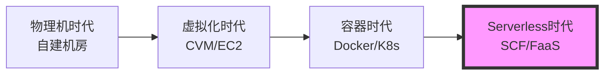
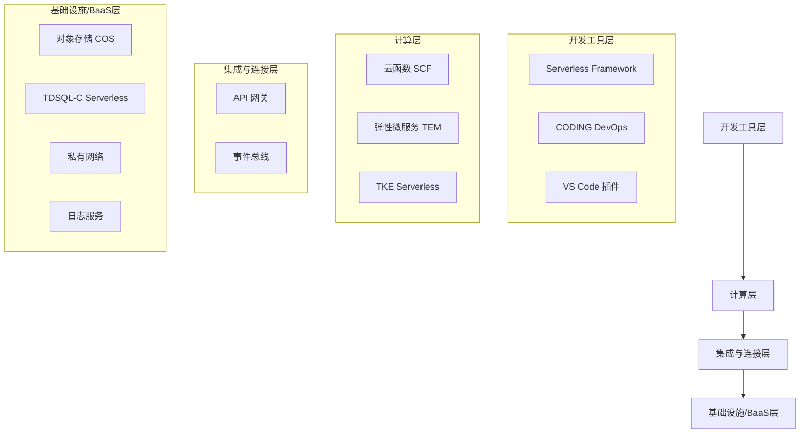

# 2.15 Serverless 云函数概述及最佳实践

## 课程简介

Serverless（无服务器）架构被誉为云计算的下一代默认计算范式。它将开发者从繁重的服务器运维中解放出来，实现“只关注业务逻辑，不关心底层资源”。本课程将深入解析 Serverless 的核心理念，详细介绍腾讯云云函数（SCF）的运行机制、触发器模式，并结合 Web 后端、文件处理等真实场景讲解架构设计与最佳实践。

### 学习目标

通过本课程的学习，您将能够：

- ✓ **理解 Serverless 本质**：掌握 FaaS（函数即服务）与 BaaS（后端即服务）的概念。
- ✓ **熟悉产品矩阵**：了解腾讯云 SCF、API 网关、Serverless Framework 等生态组件。
- ✓ **掌握 SCF 核心能力**：理解冷启动、层（Layer）、版本别名、VPC 互通等技术细节。
- ✓ **设计 Serverless 架构**：能够设计基于 API 网关 + SCF 的 Web 服务，以及基于 COS 触发的数据处理流水线。
- ✓ **实施最佳实践**：掌握如何优化冷启动耗时、配置预置并发及进行成本优化。

---

# 第一部分：Serverless 技术演进与核心理念

> **本部分导读**  
> Serverless 不是没有服务器，而是将服务器的管理权完全交给云厂商。本部分将从 IT 架构演进的角度阐述 Serverless 的必然性。

## 一、计算架构的演进

从物理机到 Serverless，计算资源的颗粒度越来越细，维护成本越来越低。



### 1.1 各阶段对比

| 阶段 | 资源颗粒度 | 计费模式 | 运维关注点 | 扩容速度 |
| :--- | :--- | :--- | :--- | :--- |
| **物理机** | 台 | 购买硬件 (CapEx) | 硬件、网络、电力、OS | 月/周 |
| **虚拟机 (CVM)** | 实例 | 包年包月/按量 (OpEx) | OS、补丁、环境配置 | 分钟级 |
| **容器 (TKE)** | 容器 (Pod) | 按节点或核数 | 集群管理、镜像构建 | 秒级 |
| **Serverless (SCF)** | **函数 (Function)** | **按调用次数+运行时间** | **仅关注代码逻辑** | **毫秒级** |

## 二、Serverless 的核心定义

Serverless = **FaaS (函数即服务)** + **BaaS (后端即服务)**

- **FaaS (Function as a Service)**：承载计算逻辑。例如腾讯云 SCF，代码段在事件触发时运行，运行完即销毁。
- **BaaS (Backend as a Service)**：承载状态和存储。例如云数据库 TDSQL-C Serverless、对象存储 COS、消息队列 TDMQ。

### 2.1 核心价值 (Why Serverless?)

1.  **0 运维 (NoOps)**：无需购买服务器，无需 SSH 登录，无需安装操作系统和 Runtime。
2.  **极致弹性 (Auto-Scaling)**：从 0 到 10000 并发仅需几秒，流量洪峰过去后自动缩容到 0。
3.  **按需付费 (Pay-as-you-go)**：代码不运行不收费。对于波峰波谷明显的业务，成本可降低 70% 以上。
4.  **快速迭代**：专注于编写核心业务函数，极大地缩短了 TTM (Time to Market)。

---

# 第二部分：腾讯云 Serverless 产品矩阵

> **本部分导读**  
> Serverless 不仅仅是云函数，而是一整套生态系统。

## 一、Serverless 产品全景图



## 二、核心组件解析

### 2.1 云函数 (SCF)
腾讯云核心 FaaS 产品，支持 Python, Node.js, Java, Go, PHP 等多种语言，支持自定义镜像（Custom Image）。

### 2.2 API 网关 (API Gateway)
Serverless 的“大门”。提供 HTTP/HTTPS 入口，负责流量控制、鉴权、API 版本管理，将 Web 请求转换为事件触发 SCF。

### 2.3 Serverless Framework
开发框架工具（CLI）。通过 `serverless.yml` 配置文件，一键部署函数、网关、数据库等资源，解决 Serverless 资源编排难题。

### 2.4 TDSQL-C Serverless
Serverless 架构的数据库最佳拍档。支持计算资源随负载自动启停，无连接时自动暂停计费，完美契合 SCF 的弹性特性。

---

# 第三部分：云函数 SCF 核心原理与能力

> **本部分导读**  
> 深入理解 SCF 的触发机制、生命周期和冷启动问题，是设计高性能 Serverless 架构的关键。

## 一、事件驱动架构 (Event-Driven)

SCF 是由**事件**触发运行的。

**常见触发器类型：**
1.  **HTTP 触发器**：API 网关收到请求 -> 触发函数（Web 后端）。
2.  **对象存储 COS 触发器**：文件上传/删除 -> 触发函数（图片处理、ETL）。
3.  **定时触发器**：Crontab 表达式 -> 触发函数（定时任务、报表生成）。
4.  **消息队列触发器**：CKafka/TDMQ 收到消息 -> 触发函数（流式处理）。
5.  **云日志 CLS 触发器**：日志写入 -> 触发函数（日志清洗、告警）。

## 二、函数生命周期与冷启动

### 2.1 运行过程
1.  **代码下载**：从存储下载用户代码。
2.  **环境准备**：启动容器，加载 Runtime（如 Python 环境）。
3.  **代码初始化**：执行入口函数之外的初始化代码（如数据库连接）。
4.  **执行函数**：执行 `main_handler` 逻辑。

### 2.2 冷启动 (Cold Start)
- **定义**：当很长时间没有请求或并发突增时，平台需要执行步骤 1-3，会有几百毫秒到数秒的延迟。
- **热启动**：如果容器已被复用，直接执行步骤 4，延迟在毫秒级。

### 2.3 解决冷启动的最佳实践
- **精简代码**：减少代码包体积，移除无用依赖。
- **预置并发 (Provisioned Concurrency)**：付费保留一定数量的“热容器”，确保核心业务 0 冷启动。
- **保持连接**：将数据库连接对象定义在入口函数之外（全局变量），以便在热启动中复用连接。

## 三、SCF 高级功能

1.  **层 (Layer)**：
    - 将公共依赖库（如 NumPy, FFmpeg）打包成 Layer。
    - 多个函数共享同一个 Layer，减小函数代码包体积，方便管理。
2.  **版本与别名**：
    - 发布 `$LATEST` 版本生成固定的版本号（如 v1, v2）。
    - 使用别名（Alias）指向特定版本（如 `prod` -> v1, `dev` -> `$LATEST`），实现灰度发布。
3.  **VPC 互通**：
    - 配置 SCF 访问 VPC，以便函数能连接内网的 Redis、TDSQL 或 CVM。

---

# 第四部分：Serverless 最佳实践场景

> **本部分导读**  
> 理论结合实践，我们来看三个最经典的 Serverless 应用场景。

## 场景一：Serverless Web/API 后端

**适用**：小程序后端、Web 官网、运营活动页（突发流量大）。

**架构**：
```mermaid
graph LR
    User[用户/客户端] --> APIGW[API 网关]
    APIGW --> SCF[云函数 SCF<br>(业务逻辑)]
    SCF --> Redis[云 Redis<br>(缓存)]
    SCF --> DB[TDSQL-C Serverless<br>(持久化)]
```
- **优势**：
    - 活动期间流量激增 100 倍，SCF 自动扩容抗压。
    - 活动结束流量归零，费用归零，无闲置成本。

## 场景二：对象存储文件处理 (ETL)

**适用**：图片压缩/加水印、视频转码、日志清洗、CSV 导入数据库。

**架构**：
```mermaid
graph LR
    User -- 上传图片 --> COS_Source[COS 存储桶 A<br>(原图)]
    COS_Source -- 自动触发 --> SCF[SCF<br>(图片压缩/转码)]
    SCF -- 写入 --> COS_Target[COS 存储桶 B<br>(处理后图片)]
```
- **优势**：
    - 只需要编写处理逻辑，无需搭建复杂的任务调度系统。
    - 并行处理能力强，同时上传 1000 张图片，会有 1000 个函数实例并发处理。

## 场景三：定时任务与运维自动化

**适用**：每日报表推送、数据库定时备份、资源到期检查。

**架构**：
- 配置 **Timer 触发器**（Cron 表达式）。
- **优势**：
    - 替代传统的 Linux Crontab，不需要维护一台常驻服务器。
    - 执行记录可视，自带重试机制，可靠性高。

---

# 课程总结

## 知识体系回顾

本课程系统介绍了 Serverless 及云函数 SCF：

```
Serverless 云函数
├── 核心理念
│   ├── FaaS + BaaS
│   ├── 0 运维、按需付费、极致弹性
│   └── 解决波峰波谷资源浪费问题
├── 腾讯云产品矩阵
│   ├── 计算：SCF
│   ├── 入口：API 网关
│   ├── 工具：Serverless Framework
│   └── 后端：TDSQL-C Serverless / COS
├── SCF 核心机制
│   ├── 事件驱动 (触发器)
│   ├── 冷启动优化 (预置并发)
│   ├── 层 (Layer) 管理依赖
│   └── VPC 网络打通
└── 最佳实践
    ├── Web 后端 (API 网关 + SCF)
    ├── 文件处理 (COS + SCF)
    └── 定时任务 (Timer + SCF)
```

## 架构师实践清单 (Checklist)

在设计 Serverless 架构时，请确认：
- [ ] **场景匹配**：业务是否是无状态的？（SCF 不存储本地状态）。
- [ ] **执行时长**：单次执行是否超过 15 分钟？（SCF 默认超时限制，长耗时任务建议用 TKE 或 异步调用）。
- [ ] **冷启动**：对延迟极其敏感的业务，是否配置了预置并发？
- [ ] **数据库连接**：是否使用了数据库连接池或全局变量复用连接？（防止连接数耗尽）。
- [ ] **成本估算**：高并发且持续运行的计算密集型业务，对比 CVM 成本是否划算？（Serverless 适合波动型流量）。

本章课程到此结束。下一章，我们将讲解 **2.16 域名服务+数字证书服务+SSL证书服务**。