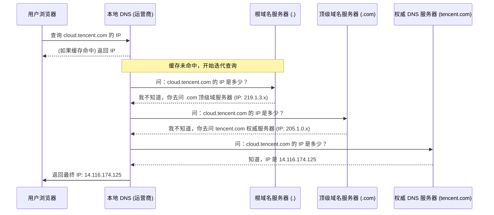
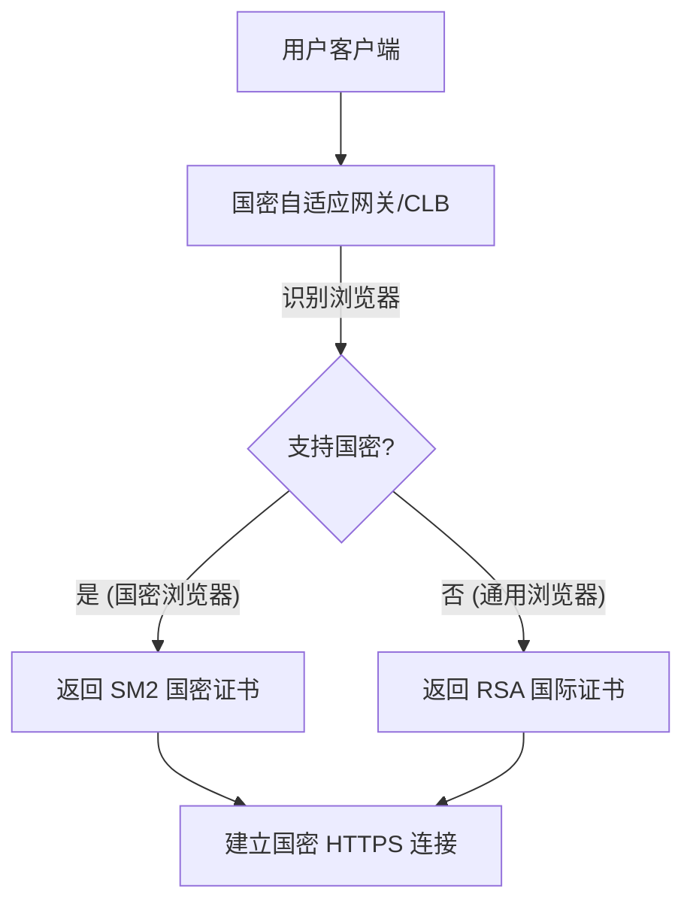

# 2.16 域名服务 + 数字证书服务 + SSL 证书服务

## 课程简介

本课程将深入讲解企业上云必备的三大基础服务：**域名解析服务 (DNS)**、**数字证书服务**以及**SSL 证书服务**。它们构成了互联网访问的入口与安全基石。我们将从底层原理出发，解析 DNS 查询全过程，探讨移动端解析痛点（HTTPDNS），并详细解读 HTTPS 加密通信背后的证书机制及国密改造方案。

### 学习目标

通过本课程的学习，您将能够：

- ✓ **掌握 DNS 原理**：深入理解域名解析的完整流程、递归查询与迭代查询的区别。
- ✓ **熟悉云解析**：了解腾讯云 DNSPod 的智能调度、负载均衡及安全防护能力。
- ✓ **解决移动端痛点**：理解 HTTPDNS 如何解决 LocalDNS 劫持和跨网访问问题。
- ✓ **精通证书管理**：掌握 SSL 证书的分类（DV/OV/EV）、申请流程及国密（SM2）证书的应用场景。
- ✓ **实施国密改造**：学会构建“国密 + 国际”双证书自适应的安全架构。

---

# 第一部分：域名服务与 DNS 解析

> **本部分导读**  
> 域名是互联网的门牌号，DNS 是导航系统。了解它们的工作原理是构建高可用网络应用的前提。

## 一、DNS 基础概念

### 1.1 什么是 DNS？
域名系统（Domain Name System，DNS）是互联网的“电话簿”。它将人类可读的域名（如 `cloud.tencent.com`）转换为机器可读的 IP 地址（如 `14.116.174.125`）。

### 1.2 域名解析流程 (The Journey of a DNS Query)

当你在浏览器输入一个域名时，幕后发生了什么？

1.  **本地缓存**：浏览器/操作系统首先检查本地缓存。
2.  **递归查询**：向**本地 DNS (LocalDNS)** 发起请求。LocalDNS 通常由运营商提供，负责替用户跑腿。
3.  **迭代查询**：
    - 问 **根域名服务器** -> 得到 **顶级域 (.com)** 地址。
    - 问 **顶级域服务器** -> 得到 **权威域 (tencent.com)** 地址。
    - 问 **权威 DNS 服务器** -> 得到最终 IP。

## 二、常见 DNS 记录类型

| 记录类型 | 全称 | 作用 | 示例 |
| :--- | :--- | :--- | :--- |
| **A** | Address | 将域名指向 IPv4 地址 | `www.example.com` -> `192.0.2.1` |
| **AAAA** | Address v6 | 将域名指向 IPv6 地址 | `www.example.com` -> `2001:0db8::1` |
| **CNAME** | Canonical Name | 别名记录，指向另一个域名 | `blog.example.com` -> `example.com` |
| **MX** | Mail Exchange | 邮件交换记录，指定邮件服务器 | 接收 `@example.com` 的邮件 |
| **TXT** | Text | 文本记录，常用于 SPF 反垃圾邮件验证 | `v=spf1 include:spf.mail.qq.com -all` |
| **NS** | Name Server | 指定该域名的权威解析服务器 | `ns1.dnspod.net` |
| **SRV** | Service | 定义特定服务的端口和主机 | 用于 SIP/XMPP 等服务 |
| **PTR** | Pointer | 反向解析，IP -> 域名 | 邮件服务器反垃圾验证 |

## 三、腾讯云 DNSPod 解析服务

腾讯云基于 DNSPod 提供企业级 DNS 解析服务。

### 3.1 核心功能
- **智能解析**：根据用户地域和运营商（移动/联通/电信），返回最近的服务器 IP，实现就近接入。
- **负载均衡**：一个域名对应多个 IP，轮询返回，分担流量。
- **宕机切换**：实时监控服务器健康状态，发现故障 IP 自动切换，秒级生效。
- **安全防护**：内置 DNS 防攻击能力，抵御 DNS Flood 等攻击。

### 3.2 移动解析 HTTPDNS
**痛点**：传统 LocalDNS 存在**域名劫持**（解析到广告页）和**调度不准**（跨网访问慢）的问题。

**解决方案**：
- App 直接通过 **HTTP 协议** 向腾讯云 DNS 服务器发送解析请求（如 `http://119.29.29.29/d?dn=www.qq.com`）。
- **绕过运营商 LocalDNS**，根治劫持。
- 获取客户端真实 IP，实现**精准调度**。

---

# 第二部分：数字证书与 SSL 证书服务

> **本部分导读**  
> HTTP 是明文传输的，极易被窃听。HTTPS = HTTP + SSL/TLS，通过数字证书实现身份验证和加密传输。

## 一、数字证书基础

### 1.1 什么是数字证书？
数字证书是互联网上的“电子身份证”。它由受信任的第三方机构（CA，Certificate Authority）签发，用于证明公钥持有者的身份。

**证书包含的关键信息：**
- **持有者信息**：域名、公司名称、组织信息。
- **公钥 (Public Key)**：用于加密数据。
- **有效期**：证书的起止时间（通常 1 年）。
- **CA 签名**：CA 机构使用其私钥对证书内容的数字签名（防篡改）。

### 1.2 HTTPS 的价值
1.  **防窃听**：数据全程加密，防止账号密码、信用卡号被盗。
2.  **防篡改**：防止运营商或黑客在网页中插入广告、恶意代码。
3.  **防劫持**：防止流量被重定向到钓鱼网站。
4.  **信任加分**：浏览器显示“安全锁”标志，提升用户信任度；利于 SEO 排名。

## 二、SSL 证书类型与选型

根据验证严格程度，SSL 证书分为三类：

| 类型 | 验证内容 | 颁发速度 | 浏览器显示 | 适用场景 |
| :--- | :--- | :--- | :--- | :--- |
| **DV (域名型)** | 仅验证域名所有权 | 分钟级 | 安全锁 | 个人博客、测试环境、中小企业官网 |
| **OV (企业型)** | 验证域名 + 企业真实身份 | 1-3 工作日 | 安全锁 + 证书详情显示公司名 | 企业官网、电商平台、政务网站 |
| **EV (增强型)** | 极其严格的身份验证 | 3-7 工作日 | 安全锁 + **地址栏绿色/显示公司名** | 银行、证券、大型支付平台 |

## 三、国密改造与双证书方案

### 3.1 背景：自主可控
为了保障国家信息安全，金融、政务等关键领域正在推行**国密算法（SM2/SM3/SM4）**替代国际算法（RSA/ECC）。

### 3.2 挑战：兼容性
主流浏览器（Chrome/Edge）默认仅支持国际算法，不支持国密算法。仅国密浏览器（如 360/红莲花）支持国密。

### 3.3 解决方案：SM2 + RSA 双证书自适应
腾讯云提供**国密自适应网关**方案：

- **服务器端**：同时部署 SM2 国密证书和 RSA 国际证书。
- **网关层**：根据客户端 `ClientHello` 消息中的加密套件（Cipher Suites）自动判断。
- **效果**：既满足合规要求（国密访问），又保证全球通用性（国际访问）。

---

# 课程总结

## 知识体系回顾

本课程串联了从域名解析到安全传输的完整链路：

1.  **域名服务**：
    - **DNS 解析**：递归 + 迭代查询模型。
    - **云解析**：智能调度、负载均衡、宕机切换。
    - **HTTPDNS**：移动端防劫持神器。
2.  **数字证书**：
    - **HTTPS**：身份认证 + 数据加密 + 完整性校验。
    - **证书类型**：DV（入门）、OV（企业）、EV（金融）。
3.  **国密安全**：
    - **SM2 算法**：国家自主可控的公钥密码算法。
    - **双证书架构**：兼顾合规与兼容的最佳实践。

## 架构师实践清单 (Checklist)

- [ ] **域名解析**：生产环境是否配置了多条 A 记录实现负载均衡？是否开启了 TTL 优化？
- [ ] **移动端**：APP 是否集成了 HTTPDNS SDK 以防止域名劫持？
- [ ] **证书管理**：
    - 是否开启了证书到期自动监控和续费提醒？
    - 核心业务是否升级到了 OV 或 EV 证书？
- [ ] **安全合规**：政务/金融业务是否实施了国密改造（双证书方案）？
- [ ] **全站 HTTPS**：是否配置了 HTTP 强制跳转 HTTPS（HSTS）？

本章课程到此结束。下一章，我们将进入云架构的观测与分析领域，讲解 **2.17 腾讯云可观测平台**。