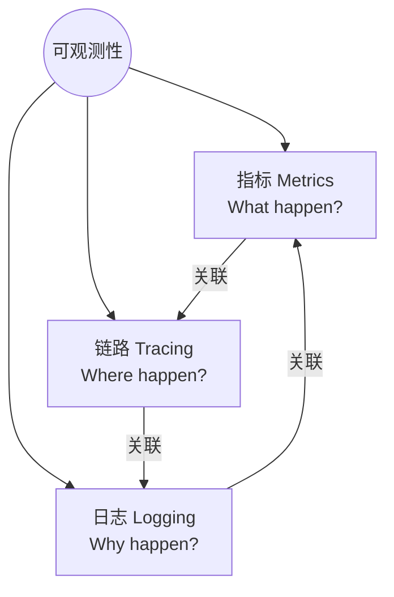
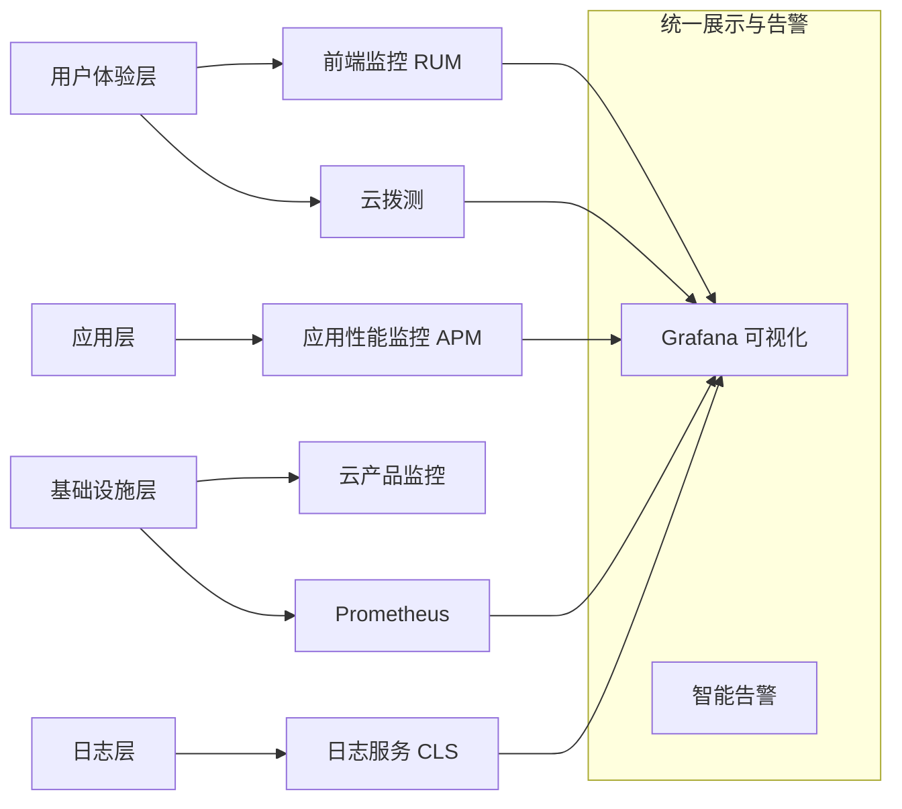

# 2.17 腾讯云可观测平台

## 课程简介

在云原生时代，应用架构日益复杂，微服务、容器化部署成为主流。传统的监控手段（仅看 CPU/内存）已无法满足需求。**腾讯云可观测平台 (Tencent Cloud Observability Platform, TCOP)** 基于指标（Metrics）、链路（Tracing）、日志（Logging）三大支柱，结合事件（Events），提供端到端的全链路监控解决方案，帮助企业实现“1 分钟发现问题，5 分钟定位根因，10 分钟恢复业务”。

### 学习目标

通过本课程的学习，您将能够：

- ✓ **理解可观测性**：区分监控（Monitoring）与可观测性（Observability）的本质区别。
- ✓ **掌握核心组件**：熟练使用 Prometheus、云拨测、APM 及前端监控（RUM）。
- ✓ **实战故障排查**：学会利用“指标-链路-日志”联动分析，快速定位慢调用与异常。
- ✓ **构建告警体系**：设计分层级的告警策略，避免告警风暴。

---

# 第一部分：可观测性概述

> **本部分导读**  
> “监控是告诉你系统挂了，可观测性是告诉你系统为什么挂了。” 本节将阐述可观测性的核心理念及腾讯云 TCOP 的架构。

## 一、可观测性的三大支柱



| 支柱 | 定义 | 特点 | 典型数据 | 对应产品 |
| :--- | :--- | :--- | :--- | :--- |
| **指标 (Metrics)** | 随时间变化的数值数据 | 聚合性强，存储成本低，适合告警 | CPU使用率、QPS、延迟 | **Prometheus** |
| **链路 (Tracing)** | 请求在微服务间的调用路径 | 展示依赖关系，定位性能瓶颈 | Span ID, Trace ID, 耗时 | **APM** |
| **日志 (Logging)** | 系统运行的离散事件记录 | 信息最丰富，存储成本高 | Error Stack, Debug Info | **CLS 日志服务** |

## 二、腾讯云可观测平台 (TCOP) 架构

TCOP 不是单一产品，而是一套组合拳，覆盖从用户端到基础架构层的全栈监控。



---

# 第二部分：核心功能详解

> **本部分导读**  
> 本节将深入解析 Prometheus、APM、云拨测及前端监控四大核心组件的原理与用法。

## 一、云原生监控 Prometheus (TMP)

### 1.1 产品定位
**Tencent Cloud Managed Service for Prometheus (TMP)** 是专为云原生环境设计的全托管监控服务。
- **完全兼容**：100% 兼容开源 Prometheus 查询语法 (PromQL) 和生态。
- **无限存储**：解决了开源 Prometheus 本地存储的容量瓶颈，支持海量历史数据回溯。
- **无感采集**：与 TKE 集群无缝集成，一键安装 Agent。

### 1.2 核心用法
1.  **ServiceMonitor**：通过 CRD (Custom Resource Definition) 动态配置采集规则，无需重启 Server。
2.  **预聚合**：针对高基数指标（High Cardinality），通过 Recording Rules 提前聚合，加速查询。
3.  **Grafana 集成**：内置丰富的 K8s 监控大盘模板（Node Exporter, Kubelet, Cadvisor）。

## 二、应用性能监控 (APM)

### 2.1 核心能力：全链路追踪
当一个订单请求失败时，APM 能还原出：
- 网关耗时 10ms -> 订单服务耗时 50ms -> **库存服务耗时 2000ms (红点异常)** -> 数据库耗时 5ms。
- 结论：库存服务是瓶颈。

### 2.2 接入方式
- **Java (无侵入)**：通过 Java Agent 字节码增强技术，无需修改代码，只需在启动参数添加 `-javaagent:agent.jar`。
- **Go/Python/Node.js**：使用 OpenTelemetry SDK 进行埋点。

### 2.3 关键功能
- **应用拓扑图**：自动绘制服务间的调用依赖关系，识别循环依赖和孤岛服务。
- **SQL 分析**：抓取慢 SQL 语句，分析数据库调用耗时。
- **JVM 监控**：实时监控 Heap 内存、GC 次数、线程池状态。

## 三、云拨测 (Cloud Dialing)

### 3.1 什么是拨测？
模拟真实用户，从全球各地的监测点（POP 点）向您的业务发起主动访问。
- **主动式监控**：在用户投诉之前发现问题。
- **黑盒监控**：关注外部表现（可用性、响应时间）。

### 3.2 典型场景
- **CDN 质量监测**：对比不同地域访问静态资源的加载速度。
- **竞品分析**：对比自己与竞品网站的响应性能。
- **接口巡检**：定时检查核心 API（如登录、支付）的连通性。

## 四、前端性能监控 (RUM)

### 4.1 Real User Monitoring (RUM)
关注**真实用户**在浏览器或小程序端的体验。
- **首屏加载时间 (FCP/LCP)**：页面多久能刷出来？
- **JS 错误率**：有多少用户遇到了白屏或报错？
- **API 成功率**：前端调用后端接口的成功率。

---

# 第三部分：故障排查实战 (Troubleshooting)

> **本部分导读**  
> 理论结合实践，演示如何利用 TCOP 进行“侦探式”故障定位。

## 场景：用户反馈“下单接口超时”

### 步骤一：查看全链路大盘 (Dashboard)
1.  打开 Grafana 业务大盘。
2.  发现 **API 成功率** 从 99.9% 跌至 80%。
3.  **P99 延迟** 从 200ms 飙升至 5000ms。
4.  **定位范围**：确认是全局问题，而非单地区网络问题。

### 步骤二：利用 APM 定位瓶颈 (Tracing)
1.  进入 APM 控制台，筛选出 `status=error` 或 `duration > 3s` 的 Trace。
2.  查看**瀑布图 (Waterfall)**。
3.  发现 `Order-Service` 调用 `Stock-Service` (库存服务) 耗时极长。
4.  进一步点击 `Stock-Service` 的 Span，发现其内部执行的一条 SQL 语句耗时 4.5s。

### 步骤三：关联日志挖掘根因 (Logging)
1.  在 APM 界面点击 **“关联日志”** 按钮（基于 TraceID 跳转 CLS）。
2.  CLS 自动过滤出该次请求的所有日志。
3.  看到日志报错：`Connection pool exhausted` (数据库连接池耗尽) 或 `Lock wait timeout exceeded` (锁等待超时)。
4.  **根因找到**：库存表存在慢查询导致锁竞争，进而拖垮了连接池。

---

# 第四部分：告警体系建设

> **本部分导读**  
> 告警不是越多越好，无效告警会导致“狼来了”效应。

## 一、告警分层策略

| 层级 | 监控对象 | 关键指标 | 通知渠道 | 响应时效 |
| :--- | :--- | :--- | :--- | :--- |
| **业务层** | 订单、支付、GMV | 下单跌零、支付失败率 | 电话 + 短信 | **5分钟 (P0)** |
| **应用层** | 微服务、接口 | QPS、P99 延迟、错误率 | 企业微信/钉钉 | **15分钟 (P1)** |
| **资源层** | CVM、K8s、DB | CPU、内存、磁盘 IO | 邮件 + 工单 | **1小时 (P2)** |

## 二、智能告警与收敛
- **告警收敛**：同一故障引发的 100 条告警（如网络中断导致所有服务报错），合并为 1 条发送。
- **动态阈值**：基于 AI 算法，自动学习历史趋势。例如“CPU 使用率突增 50%”（而非固定 > 80%）触发告警。

---

# 课程总结

## 知识体系回顾

本课程构建了云原生可观测性的完整图谱：

```
腾讯云可观测平台
├── 数据采集
│   ├── Prometheus (指标)
│   ├── APM (链路)
│   ├── CLS (日志)
│   └── RUM/拨测 (体验)
├── 核心能力
│   ├── 全链路追踪 (Trace)
│   ├── 多维分析 (Grafana)
│   └── 智能告警
└── 最佳实践
    ├── 故障定位三板斧 (指标->链路->日志)
    └── 告警分层治理
```

## 架构师实践清单 (Checklist)

- [ ] **全栈覆盖**：是否同时部署了基础设施监控(Prometheus)和应用监控(APM)？
- [ ] **日志关联**：业务日志中是否注入了 `TraceID`，以便于链路联动？
- [ ] **用户体验**：是否配置了云拨测，关注外部用户的访问质量？
- [ ] **告警有效性**：是否定期复盘告警记录，屏蔽无效告警，优化阈值？
- [ ] **数据留存**：是否根据合规要求设置了日志和指标的存储时长（如 15天/180天）？

本章课程到此结束。通过本章的学习，您已具备了构建企业级监控体系的能力，能够为业务的稳定性保驾护航。下一章，我们将进入 **第三章：云架构设计实践**，开始通过实战案例将所学知识融会贯通。