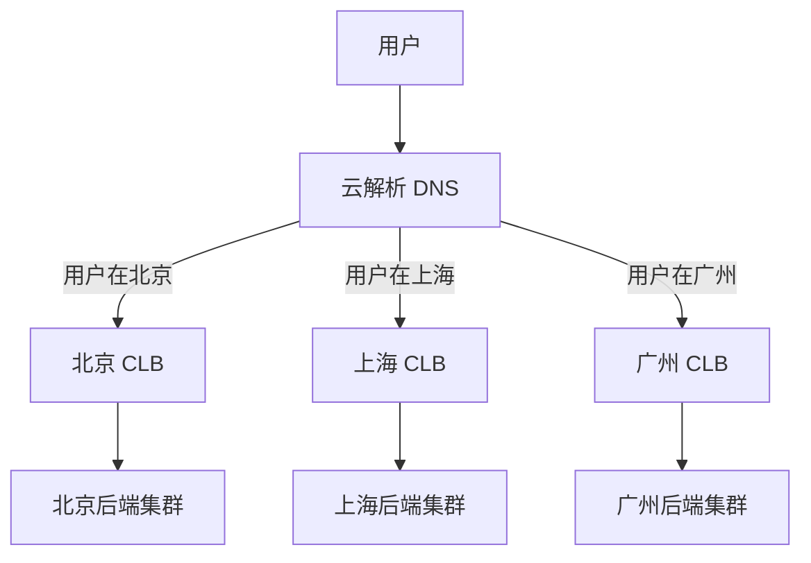

# 2.5 负载均衡 (CLB) 及最佳实践

## 课程简介

在现代高并发架构中，单台服务器已无法满足业务需求。负载均衡（Cloud Load Balancer，CLB）作为流量管理的“交通指挥官”，通过将流量分发到多台后端服务器，实现了系统的横向扩展（Scale-out）和高可用。本课程将深入解析腾讯云负载均衡的核心原理、转发策略、IP 技术及多场景下的最佳实践。

### 学习目标

通过本课程的学习，您将能够：

- ✓ **掌握 CLB 核心原理**：理解四层（TGW）与七层（STGW）负载均衡的架构差异及流量转发路径。
- ✓ **精通流量调度算法**：掌握轮询、加权最小连接、源地址哈希等算法的适用场景。
- ✓ **灵活运用 EIP**：理解弹性公网 IP 的独立性，并掌握 Anycast 加速、精品 BGP 等高级特性。
- ✓ **设计高可用架构**：学会利用多可用区部署、全局负载均衡（DNS+CLB）及横向扩展策略构建健壮的业务系统。
- ✓ **实施 IPv6 改造**：掌握 IPv6 负载均衡及 NAT64 技术，实现业务的平滑升级。

---

# 第一部分：负载均衡 CLB 核心概述

> **本部分导读**  
> 了解 CLB 是如何通过虚拟服务地址（VIP）将多台服务器“伪装”成一个高性能服务池的。

## 一、什么是负载均衡 (CLB)

负载均衡（CLB）是一种对流量进行按需分发的服务。它通过设置一个统一的虚拟服务地址（VIP），将来自客户端的访问请求均匀分发到后端的可以多台服务器上。

**核心价值：**
1.  **流量分发**：将重负载分摊到多台机器，提升整体吞吐量。
2.  **消除单点**：自动屏蔽故障机器，确保业务不中断。
3.  **横向扩展**：业务增长时，只需向后端资源池添加服务器即可。

## 二、CLB 三大组件

| 组件 | 说明 | 作用 |
| :--- | :--- | :--- |
| **负载均衡实例 (Instance)** | 运行的负载均衡服务实体 | 对外提供 VIP，接收流量入口。 |
| **监听器 (Listener)** | 流量分发规则配置器 | 定义协议（TCP/UDP/HTTP/HTTPS）、端口和转发算法。 |
| **后端服务器 (Real Server)** | 实际处理请求的 CVM 实例 | 接收转发来的请求，处理并返回响应。 |

## 三、五大核心特性

1.  **高性能**：支持亿级并发连接和每秒百万级请求（QPS）。
2.  **高可用**：集群化部署，服务可用性高达 99.95%。
3.  **高弹性**：结合弹性伸缩（AS），随流量自动增减后端服务器。
4.  **安全稳定**：内置 DDoS 防护（基础版），支持 WAF 集成。
5.  **低成本**：按量计费，相比自建 LVS/Nginx 集群大大降低运维成本。

---

# 第二部分：架构原理与转发机制

> **本部分导读**  
> 腾讯云 CLB 背后的技术黑科技：TGW 与 STGW。

## 一、底层架构：四层与七层

### 1.1 四层负载均衡 (基于 TGW)
- **技术栈**：基于腾讯自研的 **TGW (Tencent Gateway)**。
- **特点**：
    - 使用 **DPDK** 高性能数据平面开发套件。
    - **抗攻击**能力强，单集群支持亿级并发。
    - **业务案例**：腾讯游戏、微信、QQ 等海量业务。
- **协议**：TCP, UDP。

### 1.2 七层负载均衡 (基于 STGW)
- **技术栈**：基于腾讯自研的 **STGW (Secure Tencent Gateway)**，底层基于 Nginx 深度优化。
- **特点**：
    - 支持复杂的**内容路由**（基于域名、URL 路径转发）。
    - 支持 **SSL 卸载**，集中管理证书，减轻后端服务器 CPU 压力。
    - **业务案例**：腾讯新闻、理财通、微信支付。
- **协议**：HTTP, HTTPS。

### 1.3 流量转发路径

```mermaid
graph TD
    Client[客户端] --> TGW[四层负载均衡 TGW<br>(TCP/UDP)]
    
    subgraph 流量分层处理
    TGW -- 四层请求 --> RS1[后端服务器 CVM]
    TGW -- 七层请求 --> STGW[七层负载均衡 STGW<br>(HTTP/HTTPS)]
    end
    
    STGW -- SSL解密/内容路由 --> RS2[后端服务器 CVM]
```

1.  **入站**：所有请求首先到达四层 TGW。
2.  **分流**：
    - 若是 TCP/UDP 请求，TGW 直接根据算法转发给后端 CVM。
    - 若是 HTTP/HTTPS 请求，TGW 转发给内部集群 STGW。
3.  **处理**：STGW 进行 SSL 解密、解析域名/URL，再转发给后端 CVM。
4.  **出站**：后端 CVM 处理完后，响应数据原路返回。

## 二、流量分发算法 (核心知识)

选择合适的算法是负载均衡配置的关键。

| 算法名称 | 原理 | 适用场景 | 优缺点 |
| :--- | :--- | :--- | :--- |
| **加权轮询 (Weighted Round Robin)** | 按顺序轮流分配，权重高的分配更多。 | **通用场景**。后端服务器配置不同（如有的 4核，有的 8核）。 | 简单高效，但不考虑服务器当前真实负载。 |
| **加权最小连接数 (Weighted Least Conn)** | 优先分配给当前**连接数最少**的服务器。 | **长连接业务**（如数据库、FTP、WebSocket）。 | 能很好地处理请求处理时间长短不一的情况，避免某台机器积压。 |
| **源地址哈希 (Source Hashing)** | 根据客户端 IP 计算哈希，同一 IP 永远访问同一台服务器。 | **需要会话保持**（Session Stickiness）且未做 Session 共享的业务。 | 如果某个大客户 IP 流量巨高，可能导致单台后端机器过载（倾斜）。 |

---

# 第三部分：弹性公网 IP (EIP) 深度解析

> **本部分导读**  
> IP 地址不再是服务器的附属品，而是独立的云资源。

## 一、EIP 核心概念
**弹性公网 IP (EIP)** 是可以独立购买和持有的公网 IP 地址。
- **解耦**：EIP 与云资源（CVM/NAT/CLB）解耦，可随时绑定或解绑。
- **灵活**：后端服务器故障时，可将 EIP 迅速重新绑定到备用服务器，IP 地址不变，业务无感知。

## 二、EIP 高级应用场景

### 2.1 Anycast 加速 IP (全球加速)
- **原理**：利用 BGP Anycast 技术，在全球多个地域发布同一个 IP 地址。
- **效果**：用户的请求会被路由到**物理距离最近**的腾讯云接入点，然后通过腾讯云**内网骨干**回传源站。
- **价值**：大幅降低跨国访问的延迟和丢包率，适用于游戏全球同服、跨境电商。

### 2.2 精品 BGP 回国
- **痛点**：传统境外线路回国访问慢、抖动大、丢包率高。
- **方案**：精品 BGP 线路优化了国际回程路径。
- **价值**：提供高质量、低抖动的跨境带宽，保障关键业务（如支付、即时通讯）的稳定性。

### 2.3 三网带宽 (边缘云协同)
- **场景**：在边缘计算节点（ECM）接入移动、联通、电信三家运营商的 EIP。
- **价值**：客户端可选择同运营商网络就近接入，通过云边协同架构，降低中心带宽成本，提升用户体验（如视频直播、云游戏）。

---

# 第四部分：负载均衡最佳实践

## 一、高可用架构设计

### 1.1 消除单点故障
- **多可用区部署 (Multi-AZ)**：
    - 购买 CLB 时选择主备可用区（如主：广州三区，备：广州四区）。
    - 后端 CVM 必须分散部署在不同可用区。
    - **效果**：当广州三区机房断电，CLB 和后端流量自动切换到广州四区。

### 1.2 健康检查 (Health Check)
- **机制**：CLB 定期向后端发送探测包（如 HTTP GET /health）。
- **策略**：一旦发现某台 CVM 响应超时或返回 500 错误，立即将其屏蔽，不再转发流量，直到其恢复正常。

## 二、全局负载均衡 (GSLB)

当业务扩展到全国甚至全球时，仅靠单地域 CLB 是不够的。

**方案：云解析 DNS + 多地域 CLB**



- **智能解析**：DNS 根据用户的来源 IP，将域名解析成最近地域 CLB 的 VIP。
- **就近接入**：北京用户访问北京机房，广州用户访问广州机房，速度最快。

## 三、IPv6 平滑演进实践

### 3.1 纯 IPv6 负载均衡
- **场景**：端到端 IPv6 通信。
- **配置**：购买 IPv6 版本的 CLB，后端绑定支持 IPv6 的 CVM。
- **优势**：快速接入 IPv6 网络，满足合规要求。

### 3.2 NAT64 负载均衡 (过渡方案)
- **痛点**：后端老旧业务改造 IPv6 成本高、周期长。
- **方案**：**IPv6 客户端 -> NAT64 CLB (转换) -> IPv4 后端服务器**。
- **价值**：
    - **零改造**：后端 CVM 和代码无需任何修改。
    - **秒级接入**：通过 CLB 即可让纯 IPv4 业务对外提供 IPv6 服务。

---

# 课程总结

## 知识体系回顾
1.  **架构**：CLB 基于 TGW（四层）和 STGW（七层）构建，性能强悍。
2.  **算法**：轮询适合通用场景，最小连接适合长连接，源地址哈希适合会话保持。
3.  **EIP**：独立的公网 IP 资源，Anycast 和精品 BGP 是跨境加速的神器。
4.  **高可用**：必须配置**健康检查**，并实施**多可用区**容灾。
5.  **IPv6**：利用 NAT64 技术可实现后端零改造支持 IPv6。

## 架构师实践清单 (Checklist)
在设计负载均衡架构时，请确认：
- [ ] **高可用**：后端 CVM 是否至少分布在两个可用区？
- [ ] **健康检查**：是否配置了正确的健康检查路径（如 `/health_check`）？
- [ ] **监听器**：Web 业务是否配置了 HTTP 转 HTTPS 重定向（强制 HTTPS）？
- [ ] **算法**：对于长连接业务（如数据库中间件），是否选择了“最小连接数”算法？
- [ ] **安全**：是否开启了 CLB 绑定的 WAF 防护？
- [ ] **证书**：HTTPS 证书是否已托管在 CLB 上进行 SSL 卸载？

下一章，我们将讲解内容加速的核心技术——**2.6 内容分发网络 (CDN) 及最佳实践**。