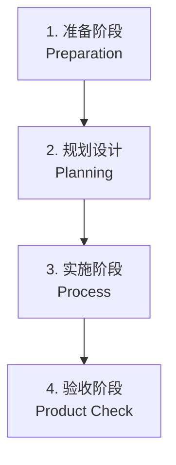

# 5.1 迁移方法论概述

## 课程简介

在数字化转型的大潮中，企业纷纷将业务系统迁移上云，以获取云计算的弹性、可扩展性和成本效益。然而，云迁移是一项复杂的系统工程，涉及技术、流程、人员等多方面挑战。本课程将系统讲解云迁移的核心方法论，涵盖迁移流程、调研评估、迁移策略选择、割接方案设计及验收标准，帮助您构建科学、高效的迁移路径。

### 学习目标

通过本课程的学习，您将能够：

- ✓ **理解迁移本质**：掌握迁移源、迁移目标等核心概念。
- ✓ **掌握迁移流程**：熟悉准备、规划、实施、验收四个标准阶段。
- ✓ **精通信息收集**：学会使用 MSP 资源扫描工具进行业务与资源调研。
- ✓ **制定迁移策略**：能够根据业务需求选择“停服迁移”或“平滑迁移”方案。
- ✓ **实施安全割接**：掌握割接演练、回滚机制及验收标准，确保零故障上线。

---

# 第一部分：迁移基础与核心概念

> **本部分导读**  
> 迁移就像一次精密的“搬家”，需要明确搬什么、搬去哪、怎么搬。

## 一、核心概念

1.  **迁移源 (Source)**：
    - 定义：待迁移的业务环境，如本地数据中心 (IDC)、其他云厂商 (AWS, Azure, Google Cloud)。
    - 内容：应用代码、数据库、文件存储、网络配置等。
2.  **迁移目标 (Target)**：
    - 定义：业务将要运行的新环境，通常是腾讯云 VPC。
    - 要求：需具备足够的计算、存储和网络资源来承载负载。
3.  **迁移工具**：
    - **DTS (Data Transmission Service)**：用于数据库实时同步。
    - **COS (Cloud Object Storage)**：用于海量非结构化数据迁移。
    - **MSP (Migration Service Platform)**：腾讯云迁移服务平台，提供一站式工具链。

## 二、迁移类比：搬家模型

| 搬家要素 | 云迁移要素 | 说明 |
| :--- | :--- | :--- |
| **物品清单** | **迁移内容** | 明确要迁移的代码、数据库、文件、配置。 |
| **货车/工具** | **迁移工具** | 选择 DTS、CDM、HyperMotion 等专业工具。 |
| **搬运方式** | **迁移策略** | 一次性搬完（全量/停服） vs 分批搬运（平滑/热迁移）。 |
| **搬家公司** | **合作伙伴** | 选择有经验的 TSP (腾讯云服务合作伙伴) 降低风险。 |

---

# 第二部分：标准化迁移流程 (4P 模型)

> **本部分导读**  
> 一个成功的迁移项目，必须遵循严谨的“准备-规划-实施-验收”四步走流程。

## 1. 准备阶段 (Preparation) —— 打牢基础
- **目标**：明确项目范围，组建团队。
- **动作**：
    - **团队组建**：确立项目经理、架构师、运维、测试人员。
    - **目标对齐**：是为了降本？扩容？还是容灾？
    - **初步调研**：了解当前架构瓶颈和风险点。

## 2. 规划设计 (Planning) —— 蓝图绘制
- **目标**：输出详细的技术方案。
- **动作**：
    - **架构设计**：云上 Landing Zone 设计（网络、账号、安全）。
    - **迁移方案**：确定数据同步方式、割接窗口、回滚预案。
    - **资源清单**：输出云资源 BOM 表（Bill of Materials）。

## 3. 实施阶段 (Process) —— 稳扎稳打
- **目标**：执行迁移操作。
- **动作**：
    - **环境搭建**：创建 VPC、子网、安全组，开通专线。
    - **数据迁移**：全量同步 -> 增量同步 -> 数据校验。
    - **应用部署**：部署应用服务，配置负载均衡。

## 4. 验收阶段 (Product Check) —— 严格把关
- **目标**：验证系统功能与性能。
- **动作**：
    - **功能测试**：核心业务流程回归。
    - **性能测试**：压测验证并发能力。
    - **安全测试**：漏洞扫描、渗透测试。
    - **业务割接**：流量切换，正式上线。

---

# 第三部分：信息收集与调研评估

> **本部分导读**  
> “知己知彼，百战不殆”。详细的调研是迁移方案成功的关键。

## 一、调研维度

1.  **业务调研**：业务逻辑、用户规模、峰值流量时间段、业务连续性要求（SLA）。
2.  **应用调研**：技术栈（Java/Go/Python）、依赖组件（中间件）、耦合关系。
3.  **数据调研**：数据量大小、数据库类型及版本、每日增量。
4.  **网络调研**：内网网段规划、公网出口带宽、互联需求。

## 二、工具辅助：MSP 资源扫描

腾讯云 **MSP (迁移服务平台)** 提供了自动化的资源扫描工具。

- **功能**：一键扫描源端（AWS/阿里云/VMware）的资源配置（CPU、内存、磁盘、带宽）。
- **模式**：
    - **在线模式**：通过 API Key 授权直接扫描云厂商资源。
    - **离线模式**：在源端服务器执行脚本（支持 Linux/Windows/Mac），生成 Excel 报表。
- **价值**：快速生成资源清单，辅助进行云上选型（Mapping），避免人工统计遗漏。

---

# 第四部分：迁移策略与割接方案

> **本部分导读**  
> 是选择“一刀切”还是“润物细无声”？取决于业务对停机时间的容忍度。

## 一、迁移策略对比

| 策略 | **停服迁移 (Cold Migration)** | **平滑迁移 (Hot Migration)** |
| :--- | :--- | :--- |
| **定义** | 停止业务，全量搬迁数据，在新环境启动。 | 业务不停，通过增量同步追平数据，快速切换。 |
| **别名** | 冷迁移、离线迁移 | 热迁移、在线迁移 |
| **流程** | 停机 -> 搬数据 -> 启服务 | 全量同步 -> 增量同步 -> 瞬间停写切换 |
| **优点** | 简单，数据一致性好控制，无需复杂同步机制。 | 业务中断时间极短（秒级/分钟级），用户体验好。 |
| **缺点** | 停机窗口长（数小时甚至数天），业务损失大。 | 技术复杂度高，需双向同步或精细化流量调度。 |
| **适用** | 非核心业务、内部系统、初次上云。 | 核心交易系统、金融/电商业务、7x24小时业务。 |

## 二、割接方案设计

割接是迁移中最惊心动魄的时刻，必须有详细的 **割接手册 (Runbook)**。

### 2.1 割接前准备
- **全量演练**：在正式割接前，至少进行一次全流程演练。
- **数据校验**：确保源端和目标端数据指纹（MD5/行数）一致。
- **环境封网**：停止非必要的变更。

### 2.2 割接流程
1.  **停写**：停止源端数据库写入（开启只读模式或切断入口流量）。
2.  **追平**：等待增量数据同步完成，确保源目数据完全一致。
3.  **切换**：修改 DNS 解析或负载均衡配置，将流量指向云端新环境。
4.  **验证**：进行核心业务拨测。

### 2.3 回滚机制 (Rollback)
如果割接失败，必须在预定窗口内回滚。
- **触发条件**：数据校验不一致、核心业务报错、性能严重下降。
- **操作**：切回 DNS 指向源端，恢复源端读写。
- **数据一致性**：若已在云端产生新数据，需考虑逆向同步回源端（双向同步方案）。

---

# 第五部分：迁移风险与应对

| 风险点 | 应对措施 |
| :--- | :--- |
| **数据丢失/不一致** | 采用“全量+增量”同步；割接前强制进行数据校验；保留源端快照。 |
| **网络不稳定** | 搭建 **迁移专线** 或 VPN；使用断点续传工具；避开网络高峰期。 |
| **业务中断过长** | 优化数据同步效率；提前预热缓存；采用平滑迁移方案。 |
| **IP 变更** | 提前梳理硬编码 IP；使用域名代替 IP；提前进行 ICP 备案和白名单变更。 |

---

# 课程总结

## 知识体系回顾
1.  **方法论**：准备 -> 规划 -> 实施 -> 验收。
2.  **调研**：利用 MSP 工具自动化盘点资源。
3.  **策略**：核心业务选平滑迁移，非核心业务选停服迁移。
4.  **割接**：演练是成功的关键，回滚是最后的保险。

## 架构师实践清单 (Checklist)
- [ ] **调研**：是否输出了完整的资源清单（CMDB）？
- [ ] **方案**：是否根据 RTO 要求选择了正确的迁移策略？
- [ ] **网络**：云上 VPC 网段是否与本地 IDC 冲突？
- [ ] **演练**：是否进行了至少一次割接演练？
- [ ] **回滚**：是否制定了详细的一键回滚方案？

本章课程到此结束。下一章，我们将介绍具体的 **5.2 云组件与迁移工具**，深入讲解 DTS、CDM 等工具的实战用法。